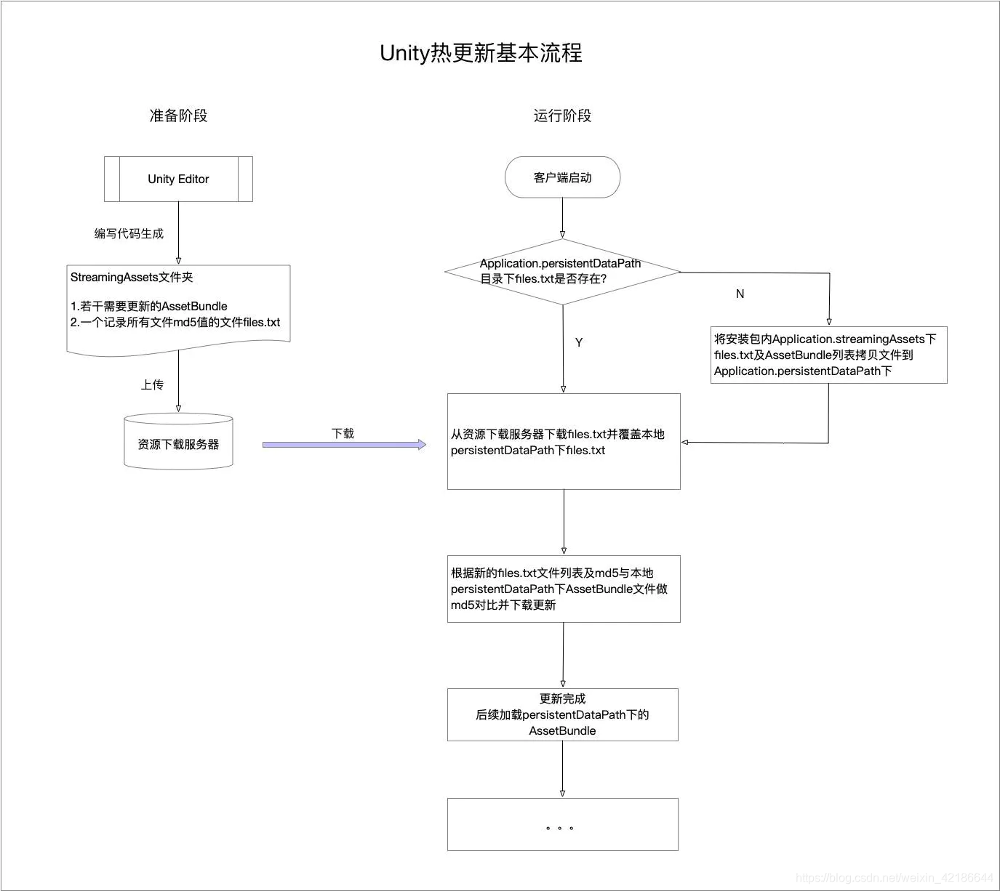

<link rel = "stylesheet" type = "text/css" href = "Notes.css" />

- [markdown系列blog](https://www.cnblogs.com/hanzongze/category/1475469.html)
- 
- git常用命令 <https://blog.csdn.net/qtiao/article/details/97783243>
- 闭包可以从类变量与类函数来作用域来理解，函数的闭包如同类中的函数调用类的变量（自由变量）。在当前作用域之外将自由变量的状态保存下来，保持对词法作用域的引用。
- 
- lua调用CS存在多种方式xlua,tolua,slua
- SetNativeSize()令image自适应大小
- redis与monogo配合mysql实现冷热数据存储
- lua调用cs脚本的绑定函数（事件实现），将对应函数绑定在cs脚本（生命周期）上，实现lua的逻辑
- 使用protobuf-net or protobuf
  - [官方实现版本过高，需要注意unity版本](https://www.cnblogs.com/caiger-blog/p/14040130.html)
- pip不是命令
  - pip未注册环境变量
  - [pip安装第三方报错](https://www.cnblogs.com/yinhaiping/p/13375375.html)
    - 添加--trusted-host有效: -i http://pypi.tuna.tsinghua.edu.cn/simple/ --trusted-host pypi.tuna.tsinghua.edu.cn
- 缺少XLua项
  - 删掉Gen文件夹重新生成
- 避免使用foreach，因为会释放内存
- 使用Mathf.PI时注意有效输入范围和结果精度（角度*PI/180 = 弧度）
- 注意组件默认设置的Color
- 设置text的对齐方式 `GetComponent<Text>().alignment = CS.UnityEngine.TextAnchor.MiddleCenter`
- image动态遮罩全屏幕
  ```C#
    self.GetComponent<Image>().SetNativeSize();
    olSize = self.sizeDelta;
    al = olSize.x / olSize.y;
    size = new Vector2(parentHeight * al, parentHeight);
    self.sizeDelta = size;
  ```
- 物体在SetActive隐藏后，脚本仍会运行
  - 脚本不被勾选，虽然大部分生命周期函数不会执行，但是内置的事件监测的方法，譬如OnMouseDown()，OnTriggerEnter();都能运行
    - 可以考虑动态加载和卸载这个脚本
- 动态设置RectTransform
  - SetInsetAndSizeFromParentEdge() 设定 RectTransform 到父对象的某一边（参数：edge）的距离（参数：inset），以及在该轴向上的大小（参数：size）。
  - SetSizeWithCurrentAnchors() 只设定 RectTransform 在某轴向（参数：axis）上的大小（参数：size），还需要 anchoredPosition 辅助设定其在该轴向上的位置。
  - rectTransform.anchoredPosition改变元素Pivot到锚框中心点的距离或返回pivot所处相对位置
  - 当 Anchors 分散（即在某方向上存在 Stretch）时，需要使用 offsetMin 和 offsetMax 的对应分量来设定位置（即 RectTransform 到父对象边缘的距离(UI元素的右上角的坐标，减去AnchorMax的值)）
  - rectTransform.rect.size返回矩形大小，sizeDelta = offsetMax - offsetMin
  - rectTransform.GetWorldCorners(corners)获取四个角的坐标,间接设置
  - 不同组件的rectTransform的变量不能直接赋予（存疑）
- 随机数设置随机数种子
  - 利用毫秒级的最后几位
    ```Lua
      ToString(os.time():reverse():sub(1,7))
    ```
  - 利用guid
    ```C#
      byte[] buffer = Guid.NewGuid().ToByteArray();
      int iSeed = BitCoverter.ToInt32(buffer, 0);
      Random rand = Random(iSeed)
      rand.Next()
    ```
  - 其他两种方法，效果更好但计算繁琐
    ```C#
      string MemeberShip.GeneratePassword(int length, int numberOfNonAlphanumericCharacters);
      RNGCrytoServiceProvider csp = RNGCrytoServiceProvider(); csp.GetBytes(byte[]);
    ```
- [Lua的数据结构——Table](https://www.jianshu.com/p/56ca3d77c7de)
- 关于碰撞检测
  - 多变体碰撞检测：分离轴定理（SAT）：依次再不同角度照射待检测物体，当存在一个角度两者影子没有重叠则分离轴存在
  - 圆形碰撞检测：略
  - Multi Box Pruning（SAP + 网格）
    - 网格：对预处理对象进行区域划分，只关注每个小格子内的遍历
      - 四叉树：维护一个四叉树数据结构，各个对象均匀分布在叶节点，当一个叶节点超出容量上限则新分出四个叶节点
    - 扫掠算法（SAP）：根据对应场景选择坐标轴，对待检测物体遍历，若不满足max1>min2&&max2>min1则不会发生碰撞
  - 散弹的碰撞检测：根据项目而定，可能会生成多个碰撞体单独检测/生成单个碰撞体检测碰撞面积
- Button在Selected状态，可以理解为按钮被按下之后，Selected的状态其实相当于一个”lock（锁定）“状态，需要执行一步”unlock（解锁）“的动作才能将按钮返回普通状态。
- DOTween在脚本结束的时候要DOKill杀死动画，例如在SetLoops之后，不然可能有意料之外的状态
- 不同组件的rectTransform不能直接赋值
- Button.colors参数修改无效，需要将整个BlockColor结构重新赋予；BlockColor需要注意colorMultipier的设置
- Dots（Data-Oriented-Tech-Stack）
  - 5 principal using Dots
    1. 组件没有函数（行为），只有状态。更严谨地讲，组件只允许有一些访问函数，用于访问状态。
    2. 系统没有状态，只有行为。
    3. 共享函数（被多个系统调用的函数）放入utility函数（辅助函数）中。
    4. （通过调整执行顺序的方式）将复杂的副作用函数延迟执行。（副作用：当调用函数时，函数在完成原本的计算任务同时还改变了外部数据），比如管理角色死亡的system，会在大部分system执行之后再执行。
    5. 系统不能调用其它系统的函数（解耦） 作者：MisakaNo10086 https://www.bilibili.com/read/cv16047480/ 出处：bilibili
- 函数的参数合法性检测：一般只在用户的输入正确性，测试阶段调试或设计兼容性高的函数时需要检测合法性